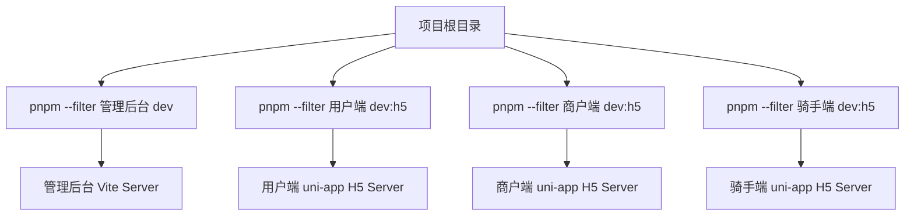

# 架构设计 (DESIGN) - 启动全栈服务预览

## 1. 整体执行架构
为了避免在同一个终端窗口中因多路日志混杂导致卡顿，我们将使用并行任务管理策略。前端分别作为独立的进程挂载到后台：

## 2. 详细技术方案
由于同时跑多个 Vite/Webpack (uni-app) 实例，可能会遇到端口冲突，工具会自动递增端口号分配 (例如 5173, 5174, 5175, 5176 等)。
- **启动指令**: 
  - `管理后台`: `pnpm --filter 管理后台 dev`
  - `三端 uni-app`: `pnpm --filter <子项目> dev:h5`
- **监控**: 将启动任务派发到后台，并等待几秒钟以确保进程没有即时崩溃。
