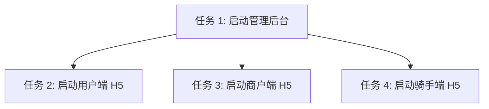

# 任务拆分 (TASK) - 启动全栈服务预览

## 任务依赖图

## 任务 1: 启动管理后台
- **输入**: 管理后台源码
- **执行步骤**: 在根目录下运行 `pnpm --filter 管理后台 dev`。
- **验收**: 命令成功推入后台运行。

## 任务 2: 启动用户端 H5
- **输入**: 用户端源码
- **执行步骤**: 在根目录下运行 `pnpm --filter 用户端 dev:h5`。
- **验收**: 命令成功推入后台运行。

## 任务 3: 启动商户端 H5
- **输入**: 商户端源码
- **执行步骤**: 在根目录下运行 `pnpm --filter 商户端 dev:h5`。
- **验收**: 命令成功推入后台运行。

## 任务 4: 启动骑手端 H5
- **输入**: 骑手端源码
- **执行步骤**: 在根目录下运行 `pnpm --filter 骑手端 dev:h5`。
- **验收**: 命令成功推入后台运行。
