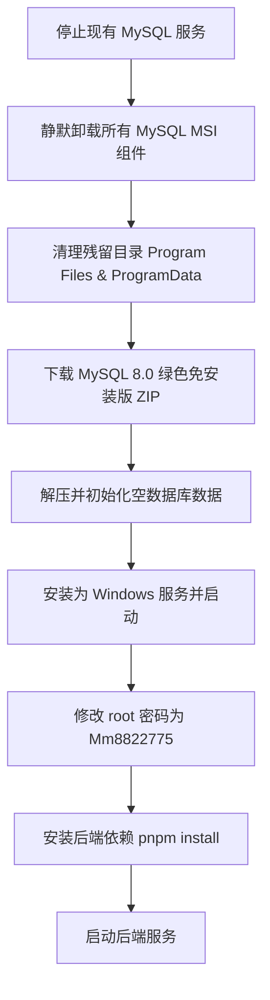

# 系统架构/设计文档 (DESIGN) - 环境准备与后端启动

## 1. 整体执行架构
为了彻底且自动化地卸载并重装 MySQL，我们将采用以下流程：

## 2. 详细技术方案

### 2.1 彻底卸载模块
- 使用 `Get-Package -Name '*MySQL*' | Uninstall-Package` 或通过 GUID 调用 `msiexec /x {GUID} /qn` 进行静默卸载。
- 强杀 `mysqld.exe` 进程，停止并删除 `MySQL80` 服务（如果存在残留）。
- 递归删除 `C:\Program Files\MySQL` 与 `C:\ProgramData\MySQL` 目录。

### 2.2 重新安装模块
由于通过 MSI 自动化配置 MySQL 较为复杂（容易在弹窗和缓存上卡住），我们将采用更可控的**绿色版部署（ZIP Archive）**：
1. **下载**: 从 MySQL 官网下载 `mysql-8.0.36-winx64.zip`。
2. **解压**: 解压至 `C:\mysql-8.0.36-winx64`。
3. **配置**: 生成基础的 `my.ini` 配置文件，设置端口 3306 和数据目录。
4. **初始化**: 执行 `mysqld --initialize-insecure` 初始化出一个无密码的 `root` 账户。
5. **服务安装**: 执行 `mysqld --install MySQL80` 将其注册为服务。
6. **启动与改密**: 启动服务，并通过 mysql 命令行工具执行 `ALTER USER 'root'@'localhost' IDENTIFIED BY 'Mm8822775';`。

### 2.3 后端启动验证
- 验证本地 Redis 状态 (使用 PowerShell 测试 6379 端口是否连通)。
- 在 `c:\Users\Administrator\Desktop\O2O跑腿+外卖` 执行 `pnpm install`。
- 执行 `pnpm --filter 后端 start:dev`，同时监控输出日志。
