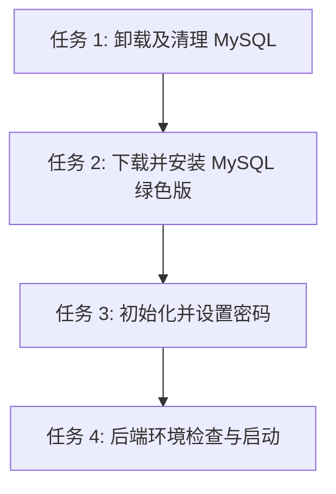

# 任务拆分 (TASK) - 环境准备与后端启动

## 任务依赖图

## 任务 1: 卸载及清理 MySQL
- **输入**: 现有系统中安装的 MySQL 组件包。
- **执行步骤**:
  1. 停止当前运行的 MySQL 服务 (`Stop-Service -Name '*mysql*' -Force`)。
  2. 获取所有 MySQL 安装包 (`Get-Package -Name '*MySQL*'`) 并通过 `msiexec /x` 强制卸载。
  3. 删除 `C:\Program Files\MySQL` 和 `C:\ProgramData\MySQL` 文件夹。
  4. 清理残留的服务注册项（若存在）。
- **验收**: `Get-Service '*mysql*'` 无结果，且上述目录不存在。

## 任务 2: 下载并安装 MySQL 绿色版
- **输入**: 网络连接，MySQL 8 压缩包下载链接。
- **执行步骤**:
  1. 通过 PowerShell 下载 `mysql-8.0.36-winx64.zip` 到临时目录。
  2. 解压到 `C:\mysql-8.0.36-winx64`。
  3. 创建 `my.ini` 配置文件至安装目录。
- **验收**: `C:\mysql-8.0.36-winx64\bin\mysqld.exe` 文件存在且 `my.ini` 已就位。

## 任务 3: 初始化并设置密码
- **输入**: 安装好的 MySQL 绿色版。
- **执行步骤**:
  1. 执行 `mysqld --initialize-insecure --console` 初始化无密码数据。
  2. 执行 `mysqld --install MySQL80` 安装为服务。
  3. 执行 `Start-Service MySQL80` 启动服务。
  4. 使用 mysql 客户端执行 `ALTER USER 'root'@'localhost' IDENTIFIED BY 'Mm8822775';` 修改密码。
- **验收**: 使用 `mysql -uroot -pMm8822775 -e "SELECT 1;"` 执行成功。

## 任务 4: 后端环境检查与启动
- **输入**: 就绪的 MySQL、运行中的 Redis、O2O 项目源码。
- **执行步骤**:
  1. 测试 Redis 连接 (127.0.0.1:6379)。
  2. 在项目根目录执行 `pnpm install`。
  3. 进入 `后端` 或使用 `pnpm --filter 后端 start:dev` 启动应用，并捕获启动输出。
- **验收**: 终端显示 Nest application successfully started，可访问 Swagger 或 health 接口。
