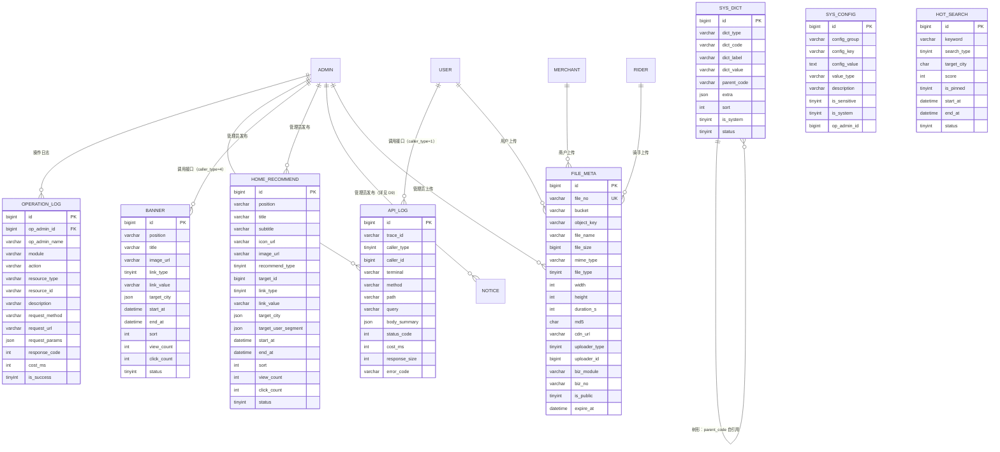

# D10 系统运营 ER 图

> 阶段：P2 / T2.19
> 范围：DESIGN §三 D10（字典/配置/操作日志/接口日志/Banner/热搜/文件/首页推荐 8 张表）

## 关键说明

- `sys_dict` 一条 = 某 dict_type 下的某项；同 `(dict_type, dict_code)` 唯一
- `sys_dict.parent_code` 树形（如行业大类→子类）
- `sys_config` 同 `(config_group, config_key)` 唯一；敏感配置（API Key/Secret）走 KMS 不入本表
- `operation_log` 与 `api_log` 在 DESIGN §六 标记为按月/周分表，本期单表落地，分表延后到 jobs/monthly-table-job.md §六
- `banner.position` 编码区分多端（`user_home_top` / `merchant_login_top` 等）
- `hot_search.search_type`：1=外卖 / 2=跑腿 / 3=通用；按 `(search_type, target_city, score)` 排序
- `file_meta` 实际文件存 MinIO/OSS；本表存元数据 + 引用关系（`biz_module/biz_no` 反查）
- `home_recommend.recommend_type` 1=快捷入口 / 2=商家 / 3=商品 / 4=活动 / 5=自定义
