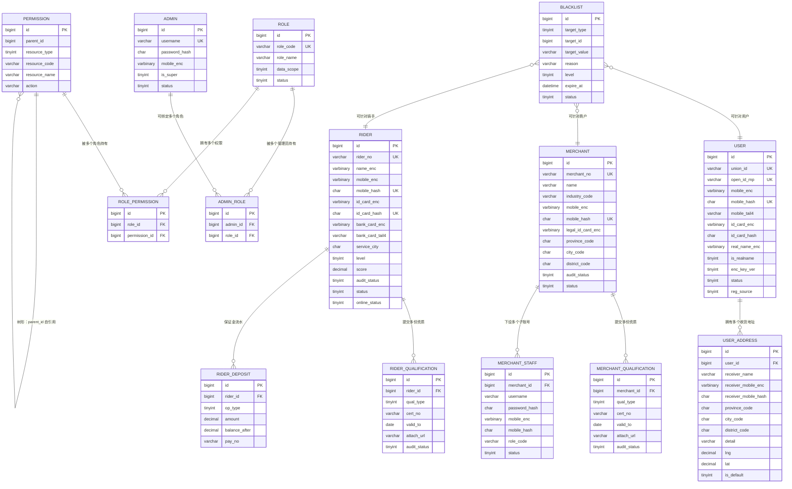

# D1 账号与认证 ER 图

> 阶段：P2 / T2.19
> 范围：DESIGN §三 D1（用户/商户/骑手/管理员/RBAC/黑名单 14 张表）
> 约定：仅展示主表关系，省略软删/审计列；逻辑外键（DB 不建物理 FK）

## 关键说明

- 用户/商户/骑手三类身份独立建表（业务流程差异大，公共字段冗余设计）
- RBAC 三表（admin/role/permission）+ 两关联表（admin_role/role_permission）实现完整权限模型
- `permission.parent_id=0` 顶级菜单，自引用形成菜单树（菜单/按钮/接口三层混合）
- `blacklist.target_type` 1=用户/2=商户/3=骑手/4=设备/5=IP，对应 `target_id` 或 `target_value`
- 所有敏感字段三列拆分：`*_enc` (AES-GCM) + `*_hash` (HMAC) + `*_tail4` (脱敏)，详见 `encryption.md`
