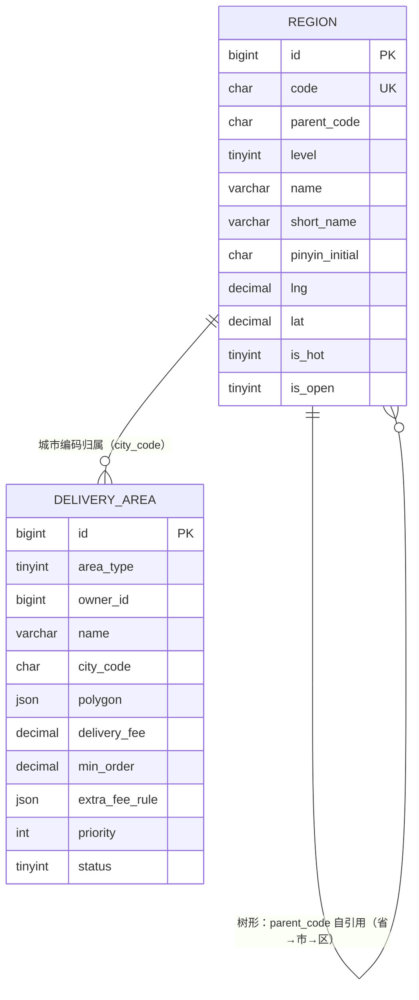

# D2 地址与区域 ER 图

> 阶段：P2 / T2.19
> 范围：DESIGN §三 D2（行政区划 + 配送区域 2 张表）

## 关键说明

- `region.code` 6 位国家统计局代码，自身唯一；`parent_code` 自引用上级（省级 parent_code='0'）
- `region.level` 1=省/2=市/3=区/县（本期不含 4 镇/街道，未来可扩展）
- `delivery_area.area_type` 1=商户配送圈（owner_id→shop.id）/ 2=平台跑腿服务区
- `delivery_area.polygon` 存 GeoJSON Polygon，应用层用 turf.js 做点-多边形判断（DESIGN §三 D2 优选 JSON）
- `region.is_open` 控制业务是否在该城市开通（首页城市切换器只展示 is_open=1）
