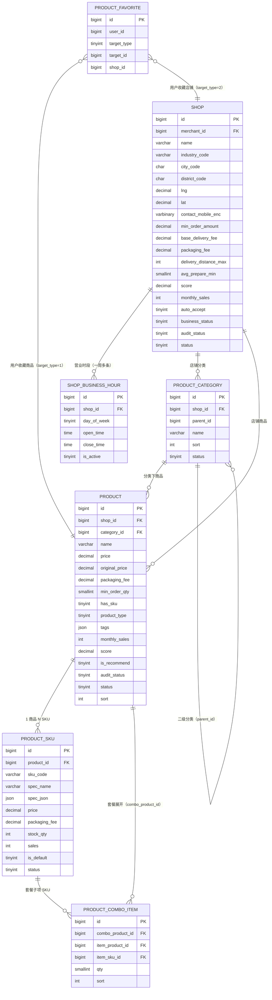

# D3 店铺与商品 ER 图

> 阶段：P2 / T2.19
> 范围：DESIGN §三 D3（店铺/营业时段/分类/商品/SKU/套餐/收藏 7 张表）

## 关键说明

- `product.has_sku=0` 单规格仍建一条 default SKU（避免应用层判空分支，库存统一在 SKU 表）
- `product.product_type` 1=普通/2=套餐/3=特价；type=2 时 `product_combo_item` 展开子项
- `shop_business_hour.day_of_week` 0=每天通用 / 1~7=周一~周日；跨天营业拆为两条
- `product_favorite.target_type` 1=商品/2=店铺，便于"我的收藏"统一展示
- 库存 `product_sku.stock_qty` 在应用层用 Redis `stock:sku:{skuId}` 缓存 + 原子扣减（详见 redis-keys.md K15）
