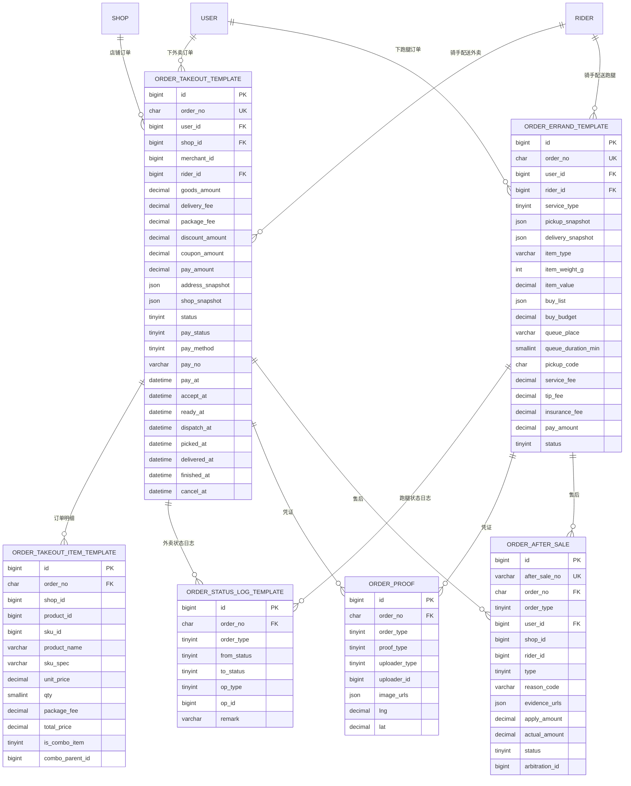

# D4 订单 ER 图

> 阶段：P2 / T2.19
> 范围：DESIGN §三 D4（订单分表 + 凭证 + 售后）
> 注意：以模板表 `_template` 表达逻辑结构；实际写入的物理表为 `_YYYYMM` 后缀



## 状态机

### 外卖订单（10 档）

```
0 待支付 → 5 已关闭(支付超时)
0 待支付 → 10 待接单 → 20 已接单待出餐 → 30 出餐完成待取
        → 40 配送中 → 50 已送达待确认 → 55 已完成
任意 → 60 已取消（用户/商户/系统）
55/40/30 → 70 售后中（用户发起售后）
```

### 跑腿订单（10 档）

```
0 待支付 → 5 已关闭(支付超时)
0 → 10 待接单 → 20 骑手已接单 → 30 已取件 → 40 配送中 → 50 已送达待确认 → 55 已完成
任意 → 60 已取消
配送阶段 → 70 售后中
```

## 分表说明

物理表名形如 `order_takeout_202604`、`order_errand_202604`，由
`sp_create_order_monthly_tables(p_yyyymm)` 存储过程从模板创建（详见 04_order.sql）。

| 模板表                      | 实际物理表（每月一张）    | 保留  |
| --------------------------- | ------------------------- | ----- |
| order_takeout_template      | order_takeout_YYYYMM      | 24 月 |
| order_takeout_item_template | order_takeout_item_YYYYMM | 24 月 |
| order_errand_template       | order_errand_YYYYMM       | 24 月 |
| order_status_log_template   | order_status_log_YYYYMM   | 12 月 |

`order_proof` 与 `order_after_sale` 不分表（体量可控）。
