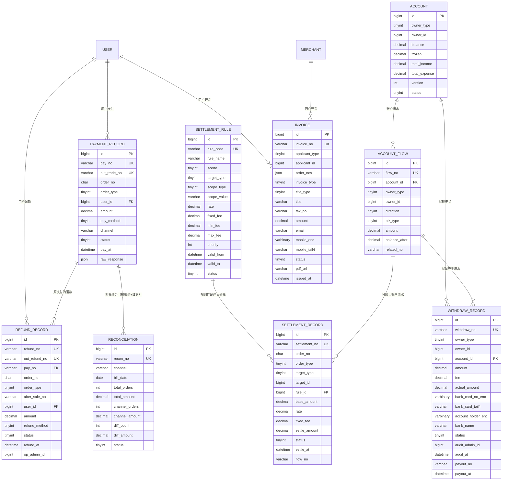

# D5 支付与财务 ER 图

> 阶段：P2 / T2.19
> 范围：DESIGN §三 D5（支付/退款/账户/流水/分账/提现/发票/对账 9 张表）

## 关键说明

- `account` 三类主体（user/merchant/rider）共用一张表，`owner_type+owner_id` 唯一
- `account_flow.direction`：1=入账 / 2=出账；`amount` 始终正数
- `account_flow` 索引 `(account_id, created_at)` 满足账单分页（DESIGN §五 / 提示词约定）
- `settlement_rule.priority` 大→优先；同 scene+target_type 多规则时按优先级匹配命中第一条
- `settlement_record` 一笔订单产 1~3 条（商户 / 骑手 / 平台），关联 `account_flow.flow_no`
- `withdraw_record` 银行卡 `bank_card_no_enc + bank_card_tail4`（DESIGN §九 / encryption.md）
- `reconciliation` 按 `(channel, bill_date)` 唯一，每日每渠道 1 条
