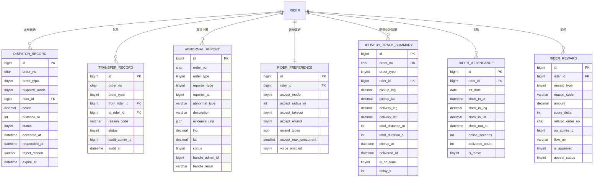

# D6 配送调度 ER 图

> 阶段：P2 / T2.19
> 范围：DESIGN §三 D6（派单/转单/异常/偏好/轨迹摘要/考勤/奖惩 7 张表）

## 关键说明

- `dispatch_record` 一笔订单可有多条派单尝试（被拒/超时未应答→重派）
- `dispatch_record.dispatch_mode` 1=系统智能派 / 2=抢单 / 3=人工指派
- `rider_preference` 一对一 rider，`uk_rider_id` 唯一
- 详细轨迹点存 TimescaleDB `rider_location_ts`（详见 `timescale/01_schema.sql`）；本表只存订单级摘要
- `rider_attendance` 一人一天一条（`uk_rider_date`）
- `rider_reward.reward_type` 1=奖励 / 2=罚款 / 3=补贴 / 4=等级升降；金额到账后写 `account_flow.flow_no`
