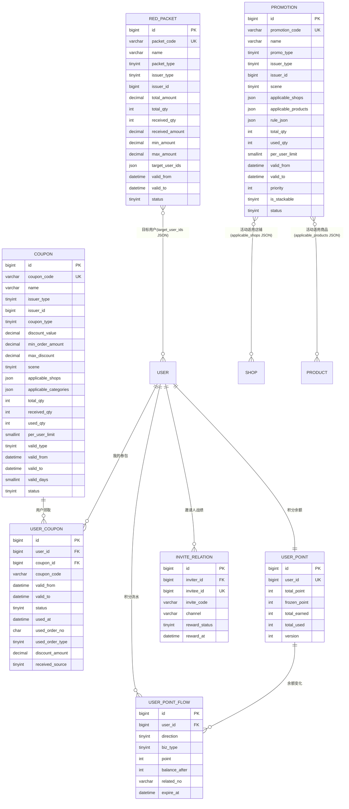

# D7 营销 ER 图

> 阶段：P2 / T2.19
> 范围：DESIGN §三 D7（券/活动/红包/积分/邀请 7 张表）

## 关键说明

- `coupon.coupon_type`：1 满减 / 2 折扣 / 3 立减 / 4 免运费
- `coupon.valid_type`：1 固定时段（用 valid_from/valid_to） / 2 领取后 N 天（用 valid_days）
- `user_coupon.status`：0 已过期 / 1 未使用 / 2 已使用 / 3 冻结（订单未支付时锁定）
- `promotion.rule_json` 不同 promo_type 表达差异（满减阶梯/折扣率/拼单人数等）
- `red_packet` 拼手气红包用 Redis Hash `redpkt:pool:{id}` 预生成份额（详见 redis-keys.md K38）
- `user_point` 一人一条；积分发生用 `user_point_flow` 流水追加
- `invite_relation.invitee_id` 唯一（一人仅被邀请一次，防刷单）
