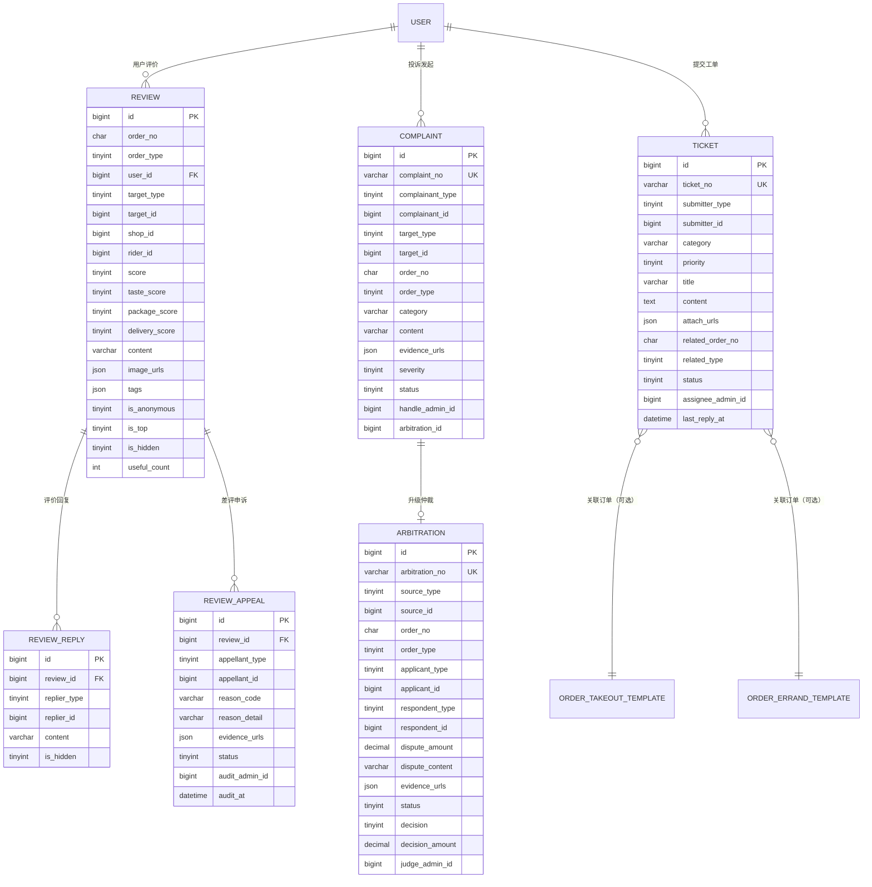

# D8 评价售后 ER 图

> 阶段：P2 / T2.19
> 范围：DESIGN §三 D8（评价/回复/申诉/投诉/仲裁/工单 6 张表）
> 决策：ticket 保留在 D8（与 complaint/arbitration 同属客服域，详见 README）

## 关键说明

- `review.target_type`：1=店铺/2=商品/3=骑手/4=综合；同 `(order_no, target_type, target_id)` 唯一
- `review.score` 总分；`taste_score/package_score/delivery_score` 子项分（外卖特有）
- `review_reply.replier_type`：1=商户回复 / 2=平台官方回复
- `review_appeal` 差评申诉，通过后 `review.is_hidden=1` 隐藏评价
- `complaint` 与 `ticket` 区别：complaint 强针对订单/对象；ticket 是通用工单
- `complaint.status=4` 转仲裁时填 `arbitration_id`
- `arbitration.source_type`：1=售后转 / 2=投诉转 / 3=主动申请
- `ticket.related_order_no` 可空（咨询类工单无订单关联）
