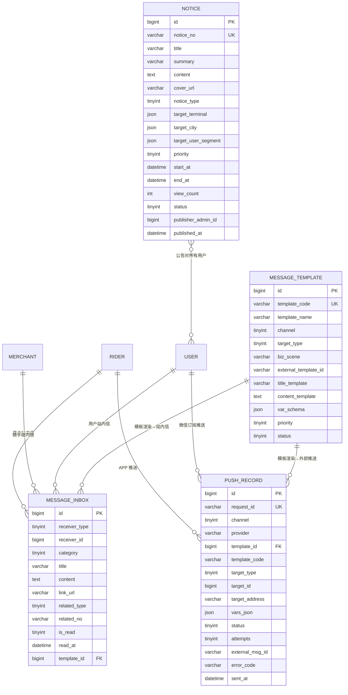

# D9 消息通知 ER 图

> 阶段：P2 / T2.19
> 范围：DESIGN §三 D9（模板/收件箱/推送/公告 4 张表）

## 关键说明

- `message_template.channel`：1 站内信 / 2 微信订阅 / 3 短信 / 4 APP 推送 / 5 站内推送
- `message_template.biz_scene` 业务场景串（如 `order_paid`、`order_canceled`、`refund_succeeded`）
- `message_inbox.category`：1 订单 / 2 活动 / 3 账户 / 4 系统 / 5 客服
- `message_inbox.is_read=0` 未读，列表查询用 `idx_receiver_read_created`
- `push_record.request_id` 业务侧生成的幂等键，避免重复推送
- `push_record.attempts` 失败重试次数，配合 Redis `push:retry:{id}`（K42）调度
- `notice.target_terminal` JSON 数组（`["user","merchant","rider","admin"]`），多端可见
- `notice.target_city`/`target_user_segment` 定向投放
