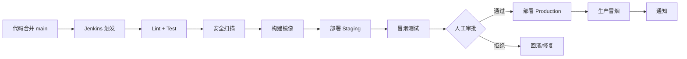

# 发布流程 Runbook

## 一、发布流程图



## 二、发布前检查清单

- [ ] 代码已 Review 并合并
- [ ] 所有测试通过（单测 + 集成）
- [ ] Staging 环境验证通过
- [ ] 无高危安全漏洞
- [ ] 数据库 Migration 已确认（如有）
- [ ] 配置变更已同步（ConfigMap/Secret）
- [ ] 回滚方案已确认
- [ ] 监控面板已打开，值班人就位

## 三、发布命令

### 标准发布（通过 Jenkins）
由 Jenkins Pipeline 自动执行，只需在审批阶段点击"部署"。

### 手动发布（紧急修复）
```bash
# 1. 构建并推送镜像
docker build -t registry.example.com/o2o/backend:hotfix-xxx -f 部署/docker/backend/Dockerfile .
docker push registry.example.com/o2o/backend:hotfix-xxx

# 2. 部署
helm upgrade o2o 部署/helm/o2o -n o2o-production \
  -f 部署/helm/o2o/values-production.yaml \
  --set image.tag=hotfix-xxx

# 3. 验证
bash 部署/ci/scripts/smoke.sh production
```

## 四、回滚

```bash
# 查看历史
helm history o2o -n o2o-production

# 回滚上一版
bash 部署/ci/scripts/rollback.sh production

# 回滚指定版
bash 部署/ci/scripts/rollback.sh production 5
```

## 五、灰度发布策略

### 后端（K8s 蓝绿）
1. 新版本 Deployment 并行部署
2. Ingress 按权重切流（10% → 50% → 100%）

### 小程序
1. 微信后台提交审核
2. 审核通过后灰度 50%
3. 观察 24h 无异常后全量

### APP
1. TestFlight / 应用商店内测
2. 分阶段发布 10% → 50% → 100%

## 六、发布记录

| 日期 | 版本 | 发布人 | 内容 | 状态 |
|---|---|---|---|---|
| | | | | |
